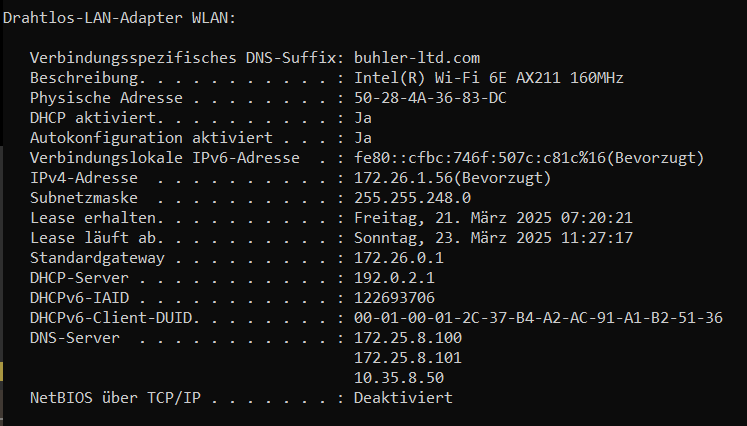
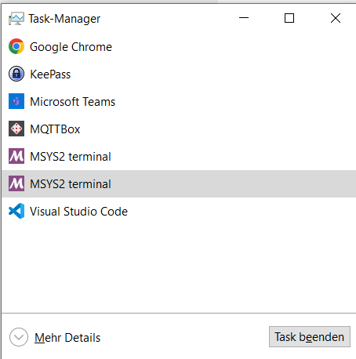
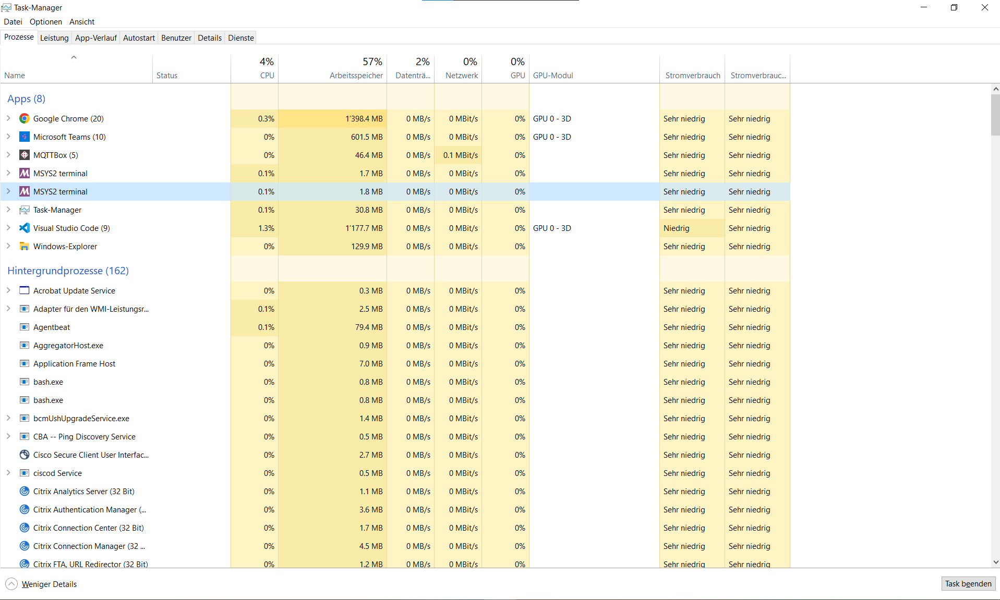
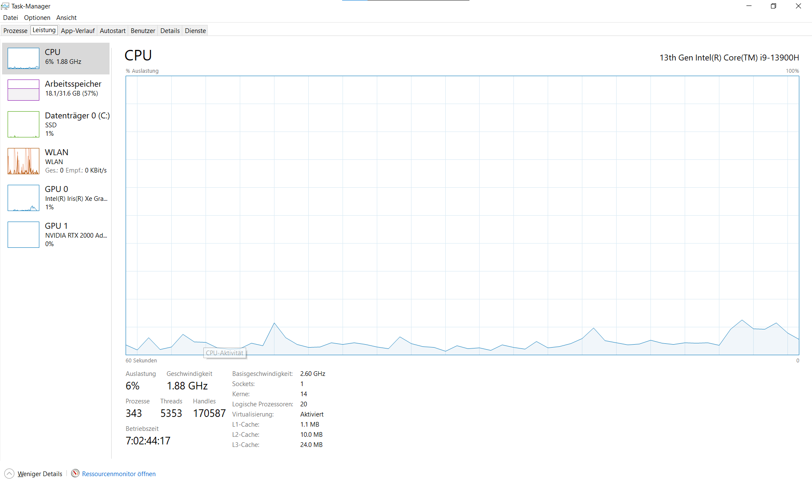
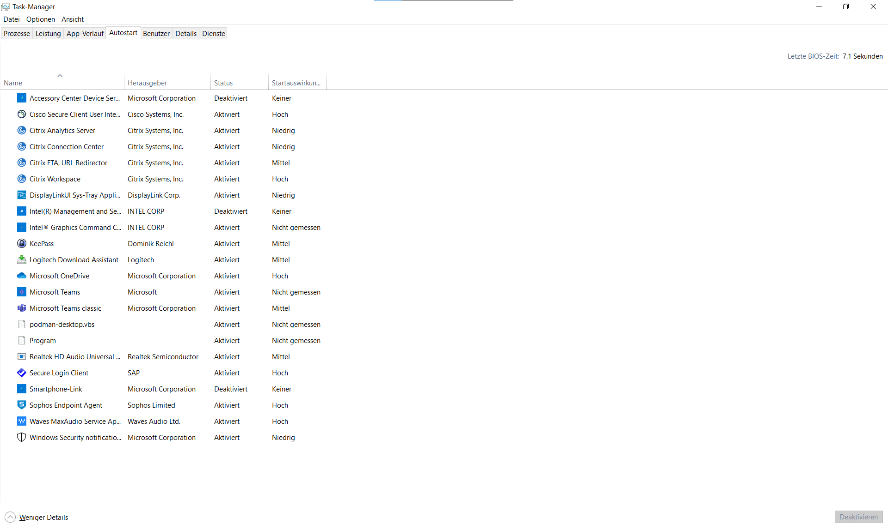
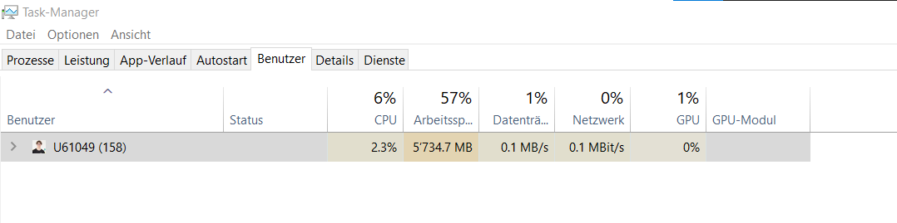

# CMD und Taskmanager

## Inhaltsverzeichnis

- [CMD und Taskmanager](#cmd-und-taskmanager)
  - [Inhaltsverzeichnis](#inhaltsverzeichnis)
  - [CMD](#cmd)
  - [Taskmanager](#taskmanager)

## CMD

Bei dieser Aufgabe, wirst du die Eingabeaufforderung von Windows verwenden und tolle Befehle kennenlernen.  
Drücke zuerst die Windows-Taste + R. Es öffnet sich ein kleines Fenster unten links. Dort tippst du jetzt `cmd` ein und drückst Enter.

Nun hat sich die Eingabeaufforderung geöffnet.  
Um zu sehen, ob alles funktioniert, kannst du jetzt als erstes den Befehl `ipconfig /all` eintippen und Enter drücken. Mit diesem Befehl kannst du sämtliche Informationen zur Netzwerkkonfiguration erhalten.  
Zum Beispiel siehst du unter `Drahtlos-LAN-Adapter WLAN` deine private IPv4-Adresse.  
Unter dem selben Absatz kannst du auch die Subnetzmaske des Netzwerks sehen. Diese entscheidet, wie viele Hosts (Computer, Drucker, etc.) in einem Netzwerk zugelassen sind.  
Unter `physische Adresse` im selben Absatz kannst du die physische Adresse deines Computers sehen. Die sogenannte MAC-Adresse.

Probiere nun alle Befehle in der folgenden Tabelle aus und sieh dir die Ergebnisse an. Falls du hilfe benötigst, kannst du entweder googeln oder mit dem Befehl `<Befehl> help` hilfe zur Benutzung des Befehls holen.

|Befehle    |Beschreibung                                     |
|     -     |                       -                         |
|cd|Wechselt in das angegebene Verzeichnis |
|cls        |CMD-Bildschirm leeren                            |
|mkdir|Verzeichnis (Ordner) erstellen|
|dir|Listet den Inhalt des aktuellen Verzeichnisses auf|
|rmdir|Löscht ein Verzeichnis|
|tree|Zeigt die gesamte Ordnerstruktur grafisch an|
|copy|Datei kopieren|
|copy con|Datei erstellen und bearbeiten. Anschliessend Ctrl + Z und dann Enter drücken, um die Datei zu speichern|
|del|Datei löschen|
|rename|Datei umbenennen|
|type|Inhalt von Textdateien anzeigen|
|color|Schrift- und Hintergrundfarbe des CMD-Fensters ändern|
|echo|Gibt Text aus|
|hostname|Zeigt den Computernamen an|
|shutdown|Fährt den PC herunter oder startet ihn neu|
|start|Startet ein Programm (z.B. chrome.exe)|
|title|Legt einen Titel für die Eingabeaufforderung fest|
|ping|Pingt einen Rechner oder Server im Netzwerk oder Internet|
|curl ascii.live/parrot|Zeigt einen tanzenden Papagei aus ASCII Zeichen. Weitere Motive findest du unter https://github.com/hugomd/ascii-live/tree/master/frames|
|curl parrot.live|Zeigt einen tanzenden Papagei aus ASCII Zeichen, welcher die Farbe wechselt|
|exit|Schliesst die Eingabeaufforderung|

## Taskmanager

Öffne den Taskmanager mit der Tastenkombination Ctrl + Shift + Esc oder per Rechtsklick auf die Taskleiste -> Taskmanager.  

Jetzt sollte das Fenster in etwa so aussehen. Nun kannst du den Chrome oder Edge Browser öffnen und den Task, der anschliessend angezeigt wird beenden. Das Fenster sollte sich jetzt wieder schliessen.

Nun kannst du auf `Mehr Details` klicken. Jetzt siehst du die einzelnen Prozesse und kannst auch die Leistung, den Autostart, etc. überprüfen.

Unter `Prozesse` sieht man die aktuell laufenden Prozesse und wie viele Ressourcen diese verbrauchen.

Unter `Leistung` sieht man, wie die Ressourcen des PCs ausgelastet sind.

Unter `Autostart` sieht man alle Programme, die nach dem Starten des PCs ausgeführt werden.

Unter `Benutzer` sieht man alle Benutzer, die auf dem PC angemeldet sind und wie viele Ressourcen diese brauchen.

Entdecke nun die verschiednen Funktionen.
