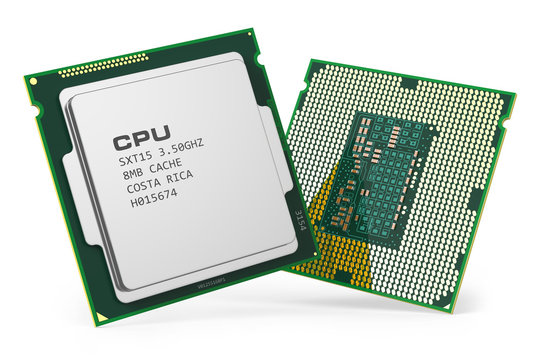
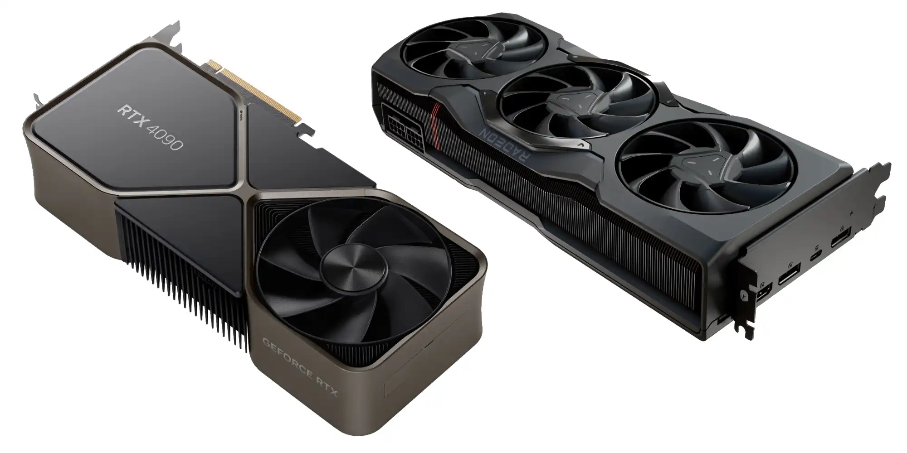
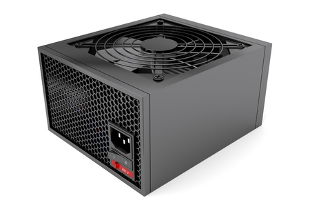
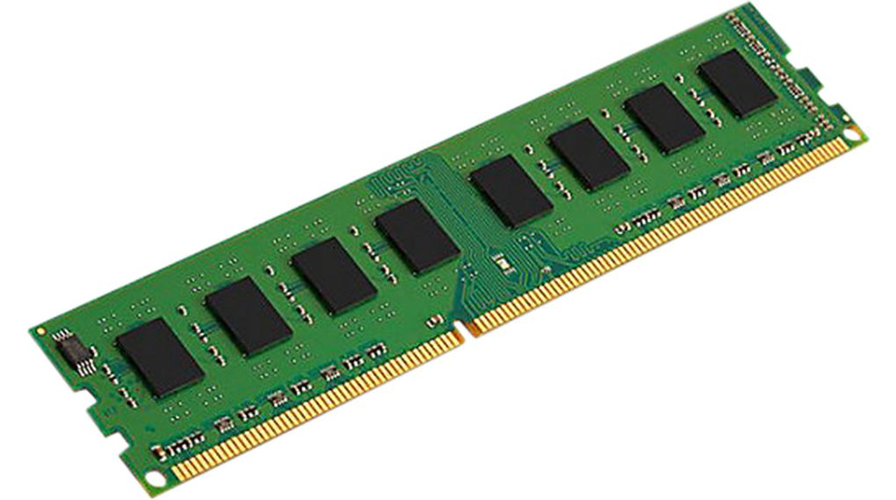
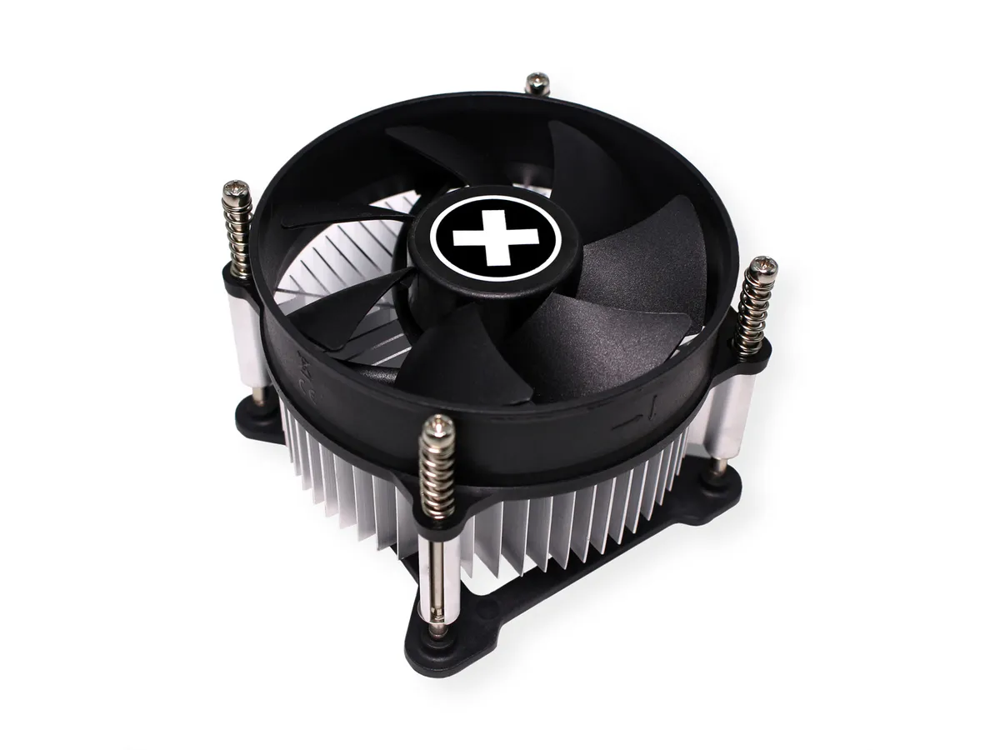
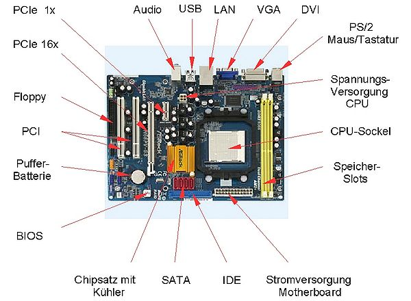
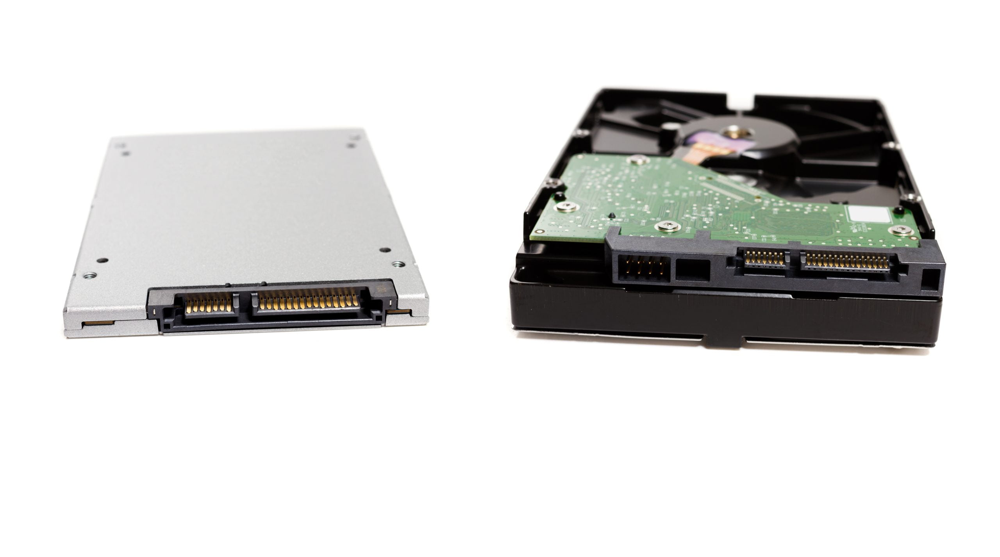
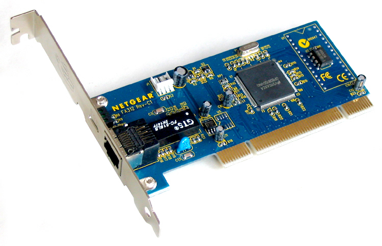
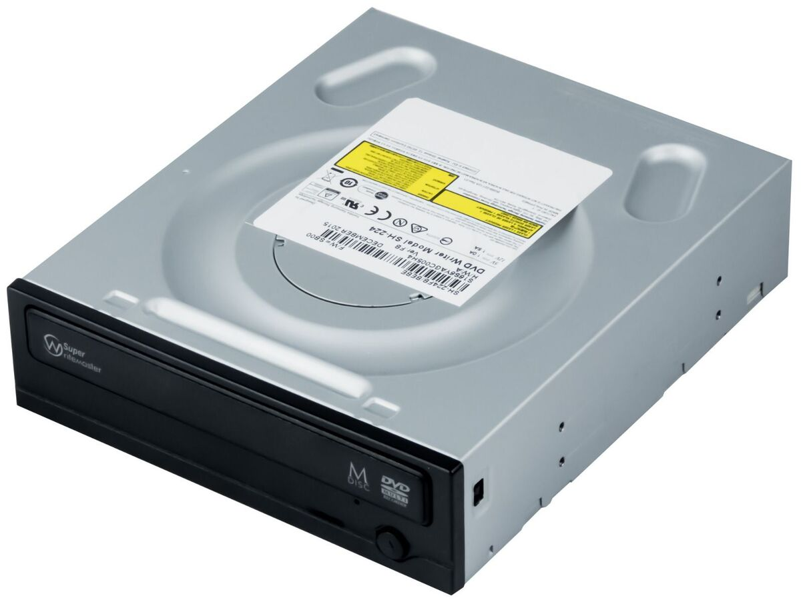

# PC Hardware kennenlernen

## Inhaltsverzeichnis

- [PC Hardware kennenlernen](#pc-hardware-kennenlernen)
  - [Inhaltsverzeichnis](#inhaltsverzeichnis)
  - [PC Hardware](#pc-hardware)
    - [CPU (Prozessor)](#cpu-prozessor)
    - [GPU (Grafikkarte)](#gpu-grafikkarte)
    - [Netzteil (Stromversorgung)](#netzteil-stromversorgung)
    - [RAM (Arbeitsspeicher)](#ram-arbeitsspeicher)
    - [Lüfter und Kühlung](#lüfter-und-kühlung)
    - [Main-/Motherboard (Hauptplatine)](#main-motherboard-hauptplatine)
    - [HDD/SSD (Festplatte/Solid-State-Drive)](#hddssd-festplattesolid-state-drive)
    - [Netzwerkkarte](#netzwerkkarte)
    - [DVD/CD-Laufwerk](#dvdcd-laufwerk)
  - [Aufgabe](#aufgabe)

## PC Hardware

Als Hardware des PCs werden alle Komponenten eines solchen bezeichnet. Also beispielsweise der Prozessor, der Arbeitsspeicher, usw.  

### CPU (Prozessor)

Die CPU ist das Gehirn des Computers. Es führt die Anweisungen von Programmen durch und ist verantwortlich für alle Rechenarbeiten und Entscheidungen im Computer.

### GPU (Grafikkarte)

Die GPU erzeugt die Bilder, die anschliessend auf dem Bildschirm angezeigt werden können. Ausserdem hilft sie der CPU besonders bei Spielen und bei der Bearbeitung von Videos.

### Netzteil (Stromversorgung)

Das Netzteil gibt allen Teilen im Computer den Strom, den sie benötigen.

### RAM (Arbeitsspeicher)

Der RAM speichert vorübergehend die Daten und Programme, die der Computer gerade verwendet. Ausserdem hilft er dem Computer, schnell auf wichtige Daten zuzugreifen. Der RAM "vergisst" aber alle gespeicherten Daten nach dem Ausschalten.

### Lüfter und Kühlung

Der Lüfter und die Kühlung halten den Computer kühl, damit er nicht überhitzt.

### Main-/Motherboard (Hauptplatine)

Das Mainboard verbindet alle Teile des Computers miteinander. Es enthält Steckplätze für die CPU, den RAM, die Grafikkarte und andere wichtige Teile.

### HDD/SSD (Festplatte/Solid-State-Drive)

Die HDD und SSD speichern deine Dateien, Bilder, Videos und Programme für lange Zeit. Das heisst, die gespeicherten Daten werden nicht "vergessen". Ausserdem ist eine SSD schneller im speichern und lesen von Dateien als eine HDD. Dafür ist eine HDD günstiger als eine SSD.

### Netzwerkkarte

Die Netzwerkkarte verbindet den Computer mit dem Internet oder anderen Netzwerken und kann entweder über ein Kabel (Ethernet) oder Drahtlos (WLAN) funktionieren.

### DVD/CD-Laufwerk

Ein DVD/CD-Laufwerk liest und schreibt Daten auf CDs und DVDs und kann zum Installieren von Programmen, Sichern von Daten und zum Abspielen von Musik oder Filmen verwendet werden.

## Aufgabe

Nun kannst du einen PC auch mal auseinanderbauen.  
Dazu kannst du zu einen der vor dir liegenden PCs auswählen und diesen mal aufmachen. Anschliessend kannst du alle Komponenten, bei denen es möglich ist, ausbauen und dir anschauen.  
Anschliessend kannst du die einzelnen Komponenten wieder einbauen. Falls du Hilfe benötigst, wende dich bitte an jemanden, der diesen Posten betreut.